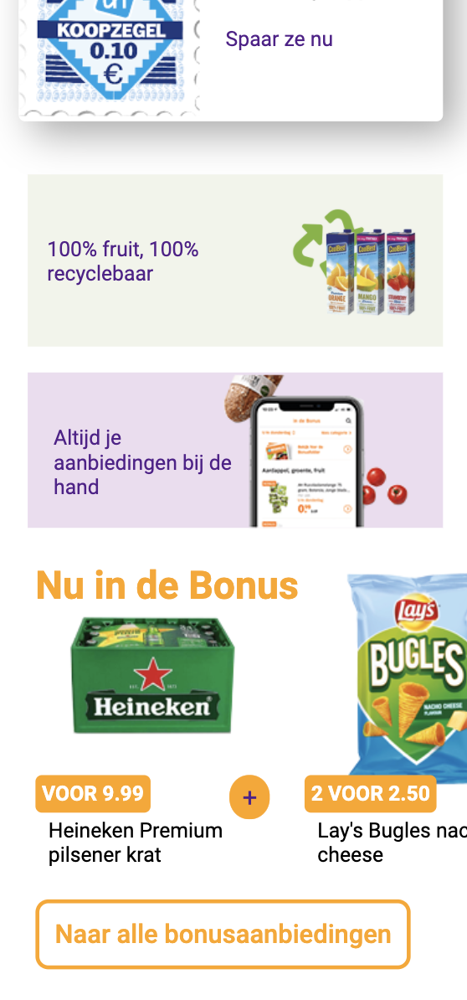

# Procesverslag
**Auteur:** Sara Wildbret

Markdown cheat cheet: [Hulp bij het schrijven van Markdown](https://github.com/adam-p/markdown-here/wiki/Markdown-Cheatsheet). Nb. de standaardstructuur en de spartaanse opmaak zijn helemaal prima. Het gaat om de inhoud van je procesverslag. Besteedt de tijd voor pracht en praal aan je website.

## Bronnenlijst
1. AH. (z.d.). Hompagina AH [Foto]. allerhande. https://www.ah.nl/allerhande
2. -bron 2-
3. -...-

## Eindgesprek (week 7/8)

-dit ging goed & dit was lastig-

**Screenshot(s):**

-screenshot(s) van je eindresultaat-

## Voortgang 3 (week 6)

-same as voortgang 1-

## Voortgang 2 (week 5)

-same as voortgang 1-

## Voortgang 1 (week 3)

### Stand van zaken

Dat het heel erg stressen was omdat sommige dingen gewoon niet wilde lukken, dus het kosten veel tijd. 

**Screenshot(s):**

### Agenda voor meeting

Stijn: 
1: Hoe maak je een oneindige loop van foto's horizontaal?
2: Hoe maak je foto's na 5 seconde veranderen inclusief tekst?

Sara:
1: Wanneer gebruik ik te veel classes?
2: Is het aantal wat ik heb te veel?

Zain:
1: Gebruik ik te veel div's?

Tim:
1: Hoe maak je een dropdown met transition die over andere tekst heen valt?
2: Hoe maak je een dropdown navigatie, die navigeert naar content op dezelfde pagina?
3: Hoe kan ik zien welke icon (<i> element) er word gebruikt? 

### Verslag van meeting

-na afloop snel uitkomsten vastleggen-

## Website tot nu toe
Bekijk mijn index.html (het is wel ontworpen voor mobiel)

## Code pen oefeningen (week 2)

Typografie: https://codepen.io/sarawildbret1/pen/LYZgggr
Positioneren: https://codepen.io/sarawildbret1/pen/GRqzemw

## Breakdownschets (week 1)

## Intake (week 1)

**Je startniveau:** blauw

**Je focus:** -kies uit responsive óf surface plane ???-

**Je opdracht:** https://www.ah.nl/allerhande

**Screenshot(s) van de eerste pagina (small screen):**

**Screenshot(s) van de tweede pagina (small screen):**

